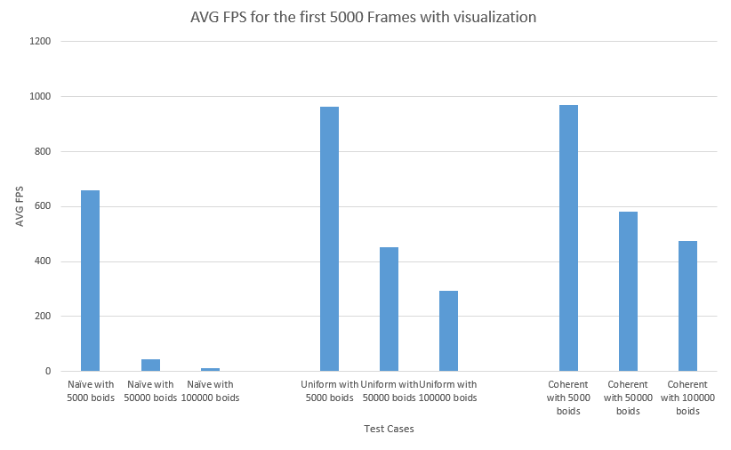
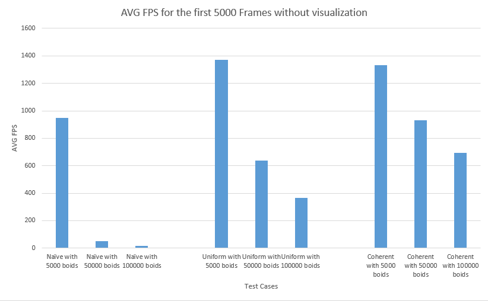
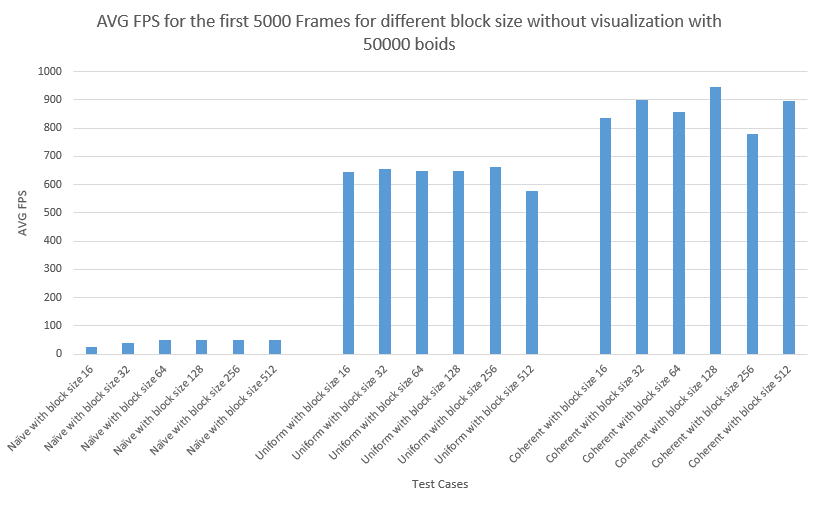

**University of Pennsylvania, CIS 565: GPU Programming and Architecture**

* Jiarui Yan
  * [LinkedIn](https://www.linkedin.com/in/jiarui-yan-a06bb5197?lipi=urn%3Ali%3Apage%3Ad_flagship3_profile_view_base_contact_details%3BvRlITiOMSt%2B9Mgg6SZFKDQ%3D%3D), [personal website](https://jiaruiyan.pb.online/), [twitter](https://twitter.com/JerryYan1997), etc.
* Tested on: Windows 10 Home, i7-9700K @ 3.60GHz 16GB DDR4 RAM, RTX 2070 SUPER 8GB Dedicated GPU memory (Personal desktop)

# Project 1 - Flocking

## Video demos

## Performance analysis
For this part, I take first 5000 frames for each test case and record there time in order to keep consistency. Then, I calculate the FPS by dividing frames to time duration. Besides, there are three experiments that I need to take care. In the first experiment, I compare the framerate change with increasing of boids for naive, scattered uniform grid and coherent uniform frid in the condition of visualization. The second experiment is same as the first one except for that it needs to be conducted without visualization. Finally, I conduct an experiment to reveal the effects of different block sizes. 

### Framerate change with increasing number for three methods with visualization

### Framerate change with increasing number for three methods without visualization

### Framerate change with increasing block size

## Questions and answers

1. For each implementation, how does changing the number of boids affect performance? Why do you think this is?

	With the increasing of the number of boids, the performance would be decreasing. Generally speaking, I think it is caused by computational requirement increased by the number of boids. Specifically, there are several reasons. First, with the increase of number of boids, we need to update more particles and let GPU deal with more threads, which require more time. Second, with more particles, we have more neighbors for each particle. This means it signiciantly increases the number of accessing memory, which would also require more time.

2. For each implementation, how does changing the block count and block size affect performance? Why do you think this is?
	
	For each implementation, the block size doesn't affect performance with an apparent rule. I think this is caused by the limit of cache size or file system size in each SM, because different implementation uses differnet amount of memory and there may be different sweet pots for different implementations.

3. For the coherent uniform grid: did you experience any performance improvements with the more coherent uniform grid? Was this the outcome you expected? Why or why not?

4. Did changing cell width and checking 27 vs 8 neighboring cells affect performance? Why or why not? Be careful: it is insufficient (and possibly incorrect) to say that 27-cell is slower simply because there are more cells to check!

## Acknowledgement
* [CIS565 2020 Fall Course link](https://cis565-fall-2020.github.io/)
